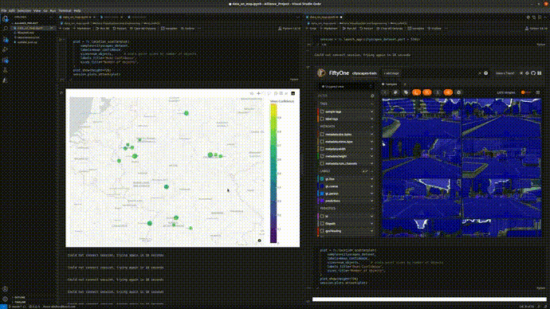

# Data on Map
## Introduction to project
The goal of the project is to display an interactive plot using the geographical coordinates present with the images as part of the metadata. The fiftyone tool from Voxel51 has been used in the development of this project. Each image consists of the bounding boxes corresponding to the ground truths and predictions of multiple objects within the image. The user is able to visualise metrics retrieved from fiftyone on a geographical scatterplot to find any correlation between the coordinates and the metrics obtained.
Apart from the view and hover capabilities, the users can also filter based on certain keywords to find specific images that fit the criteria. Tags have also been added for each object within each sample as a list so that images with specific tags can also be filtered. For example, images with pedestrians can be retrieved from the samples. 

## Steps to run the project
* Register an account in the cityscapes website and download the dataset including the metadata containing the GPS coordinates
* Run each cell of the notebook "data_on_map.ipynb" to finally see the output. Split mode can be used to view both the interactive plot and the fiftyone app simultaneously.

## Workflow

## Results

